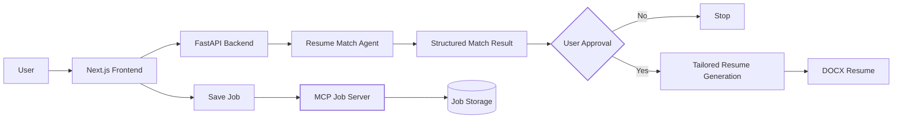

# AI Resume Matcher

An AI-powered resume matching and tailoring application that helps a job seeker evaluate how well their resume matches a job description and, with user approval, generate a tailored resume.

The project is built as a learning and portfolio project to demonstrate **LangChain agentic patterns, structured output, Human-in-the-Loop (HITL), MCP integration, and full-stack AI application development**.

## Use Case

A job seeker can:

1. Provide a resume.
2. Provide a job description.
3. Get an AI-generated match analysis.
4. Review the match before taking further action.
5. Approve the generation of a tailored resume.
6. Generate a tailored `.docx` resume based on the job requirements and existing resume content.
7. Save interesting jobs through an MCP-based job-saving service *(planned)*.

The application is designed to keep the human in control before an AI-generated resume is produced.

---

## Architecture



### Current flow

```text
Resume + Job Description
          │
          ▼
   Resume Match Agent
          │
          ▼
   Structured Match Result
          │
          ▼
      Human Review
       │       │
      No      Yes
       │       │
      Stop     ▼
       │   Tailored Resume
       │       │
       │       ▼
       │      DOCX
       │
       └──────────────
```

---

## Tech Stack

### Frontend

- **Next.js**
- **TypeScript**
- React

### Backend

- **Python**
- **FastAPI**
- **LangChain**
- OpenAI LLM
- **Pydantic** structured outputs

### Agentic AI

- LangChain `create_agent`
- Structured model output
- Human-in-the-Loop approval
- LangGraph-based interruption/resume pattern
- MCP *(planned for job saving)*

### Document Processing

- Resume text extraction
- `python-docx`
- Tailored resume generation

### Deployment

- **Vercel**
- Frontend + backend deployment configuration

---

## Current Features

### Resume / Job Matching

The application analyzes a resume against a job description and produces a structured match result.

The analysis includes areas such as:

- Overall match score
- Matching skills
- Missing skills
- Experience gaps
- Match reasoning

The result is returned using a structured schema rather than relying on free-form LLM text.

### Human-in-the-Loop

The user reviews the match result before the application generates a tailored resume.

```text
Match Result
     │
     ▼
User Approval
  ┌──┴──┐
 No    Yes
 │      │
Stop   Generate
       │
       ▼
 Tailored Resume
```

This prevents the resume-generation step from running without an explicit user decision.

### Tailored Resume Generation

After approval, the application uses the resume and job description to generate tailored resume content.

The goal is to improve relevance to the target job while staying grounded in the candidate's existing experience.

The generated resume can be returned as a `.docx` document.

---

## Project Structure

```text
ai-resume-matcher/
│
├── backend/
│   ├── ...
│   └── FastAPI + LangChain implementation
│
├── frontend/
│   ├── ...
│   └── Next.js / TypeScript application
│
├── vercel.json
├── sync-to-deploy.sh
└── README.md
```

---

# Development Phases

The project is being developed incrementally so that each phase demonstrates a specific AI/agentic capability.

| Phase | Capability | Status |
|---|---|---|
| **Phase 1** | Resume + Job Description matching | ✅ Implemented |
| **Phase 2** | Structured match results | ✅ Implemented |
| **Phase 3** | Human-in-the-Loop approval | ✅ Implemented |
| **Phase 4** | Tailored resume generation | ✅ Implemented |
| **Phase 5** | PII protection / middleware | 🔄 Planned |
| **Phase 6** | MCP job-saving server | 🔄 Planned |
| **Phase 7** | Additional production/agent capabilities | 🔄 Future |

## Phase 1 — Resume Matching

Build the core resume matching capability.

```text
Resume + Job Description
          │
          ▼
     Match Agent
          │
          ▼
   Structured Result
```

**LangChain concepts:**

- `create_agent`
- Agent state
- Structured output
- Pydantic schemas

---

## Phase 2 — Structured AI Results

The matching agent returns a predictable structured response instead of unstructured text.

This allows the frontend to display individual match attributes such as:

- Score
- Matching skills
- Missing skills
- Experience gaps
- Reasoning

---

## Phase 3 — Human-in-the-Loop

Add an explicit approval step before resume generation.

```text
Match Result
     │
     ▼
  HITL Gate
  /      \
No        Yes
│          │
Stop    Generate
```

This demonstrates an important agentic pattern: **the LLM does not make the final decision on whether to proceed.**

---

## Phase 4 — Tailored Resume Generation

After user approval, the application generates a tailored version of the resume.

```text
Resume
   +
Job Description
   │
   ▼
Resume Generation
   │
   ▼
Tailored Resume
   │
   ▼
  .docx
```

The generation step is intended to improve alignment with the target job without inventing experience or qualifications.

---

## Phase 5 — PII Protection

**Planned**

Add middleware-based PII protection so personally identifiable information can be controlled before information is sent to the LLM.

Potential capabilities include:

- PII detection/redaction
- Middleware around model calls
- Preventing accidental PII exposure
- Validating model inputs/outputs

This phase will demonstrate LangChain middleware patterns such as:

- `AgentMiddleware`
- `before_model`
- `after_model`
- `wrap_model_call`
- `PIIMiddleware`

---

## Phase 6 — MCP Job Saving

**Planned**

Add a separate **Save Job** capability using an MCP server.

```text
Job Description
      │
      ▼
   Save Job
      │
      ▼
 LangChain / MCP Client
      │
      ▼
    MCP Server
      │
      ▼
   Job Storage
```

The goal is to demonstrate how an AI application can use an external MCP server as a tool provider.

The MCP portion will be intentionally separated from the resume-matching flow so the project demonstrates both:

- **Agentic AI / LangChain**
- **MCP client + MCP server integration**

---

## Project Goal

This project is primarily a hands-on exploration of modern AI application development.

It demonstrates how to combine:

- LLMs
- LangChain agents
- Structured output
- Human-in-the-Loop workflows
- FastAPI
- Next.js / TypeScript
- Document generation
- Middleware and PII protection
- MCP servers and tools

The goal is to evolve the application incrementally from a simple resume matcher into a more complete **AI-powered job application assistant**.